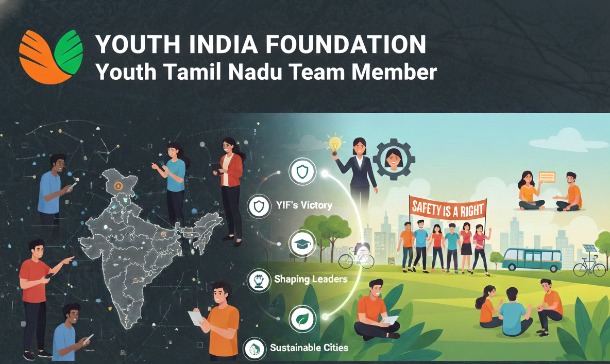

# My Content Strategy Journey: Driving Impact Through Visual Storytelling at YIF

---

My work at the Youth India Foundation (YIF) focused on transforming crucial social missions into engaging digital content. As a Video Editing Intern within the IT and Graphic Team for the Youth Tamil Nadu wing, my contribution went beyond just editing. I conducted in-depth research for every reel to ensure the highest level of context and accuracy, collaborating with teammates across the country to deliver a unified message. The core of my role was to function as a content strategist, using simple, clear visuals and language to make a real-world difference.

---

## Introduction: The Authenticity Behind My Actions

This article summarizes the narrative, visual strategy, and intended impact of five key video reels I produced for the Youth India Foundation. From building trust in our organization's capabilities to demanding safety for women, each video I created was designed to achieve a specific behavioral outcome in the viewer moving them from awareness to active participation. The structure below details the story, the visual choices I made (like black and white contrast), and the difference each piece aimed to make.

---

### **Reel Overview**

| Reel Folder | Topic | Instagram Link (Youth Tamil Nadu) |
|-------------|-------|-----------------------------------|
| 01_YIF_Backstory | YIF's Organizational Impact and Awards | https://www.instagram.com/reel/C9kUKl2yJ8d/?igsh=MTIzYmM2eHFydXRteQ== |
| 02_Women_in_Business | Honoring Women in Tech and Business | https://www.instagram.com/reel/C-StYcJymPJ/?igsh=MW03MzBxcjhoM2FyMQ%3D%3D |
| 03_Safety_is_a_Right | Women's Safety and Collective Action | https://www.instagram.com/reel/DAPpyEPt0Jr/?igsh=eWl4NXIxMjJpNXBu |
| 04_Shaping_Leaders | The Call to Action for Future Leaders | https://www.instagram.com/reel/C_I8XMbyQSe/?igsh=NmxpcHhkbzU2ZHdq |
| 05_Sustainable_Cities | The Vision of Sustainable Urban Development | https://www.instagram.com/reel/DAVCAjtRoSn/?igsh=MTN1a2ZlNmdvZWNpcg%3D%3D |

---

## I. YIF's Victory: Building Organizational Trust Through My Visual Narrative

### The Story Behind My Video

I designed this reel to be our strongest statement of organizational credibility. The narrative I crafted starts with the journey and vision of the founder, Shubhankar, and the dedication of the entire YIF team. It's a story of grassroots work scaling into a national movement. The message I wanted to convey is clear: YIF is a proven vehicle for change, built on quantifiable success and real impact.

### The Visual Content I Created

The visuals I chose focused on establishing scale and validation. I used precise text overlays and graphics to list our main achievements:

**Geographic Reach:** I prominently featured maps in the visuals highlighting our presence in 5+ states, showing the foundation's growth across the country. This visual element directly validates our claims of widespread impact.

**Program Showcase:** I paired key initiatives like E-School, IT Solutions, the Placement Cell, and Digital Literacy with images of youth benefiting from these programs, giving concrete faces to abstract programs.

**Social Proof:** I highlighted the awards received by YIF in the footage, acting as third-party validation that the team's work is recognized at a high level.

### What I Aimed to Achieve

My primary intent was to build trust and encourage large-scale partnerships. By detailing our achievements and reach, I aimed to convert potential volunteers and partners into active contributors, showing them that YIF is a reliable, high-impact organization. The video I created makes a difference by serving as the foundation's digital prospectus, attracting the resources needed to expand our schemes further.

---

## II. Honoring Women in Business: My Visual Manifesto for Redefining Professional Landscapes

### The Story Behind My Video

I created this video as a visual manifesto for women's empowerment in tech and business. The story I tell is a transition: moving from the personal aspirations of a young girl to the professional reality of women dominating boardrooms and startup spaces. I emphasized that female leadership is diverse, covering everything from beauty and photography to high-finance and pharmaceuticals.

### The Visual Content I Structured

I structured the visual content to show growth and transition:

**The Transition:** I began the video with a young girl to create an immediate connection to potential and future generations. I then transitioned quickly to images of women I selected who are involved in varied professional activities launching startups, presenting in boardrooms, leading design and photography showing the breadth of female influence.

**The Role Models I Featured:** I strategically chose to feature specific, powerful Indian women:

- **Falguni Nayar (Nykaa Founder):** Representing entrepreneurial disruption.
- **Ritu Kumar (Fashion Icon/Padma Shri 2013):** Representing creative leadership and cultural impact.
- **Namita Thapar (Emcure Pharmaceuticals/Shark Tank):** Showcasing corporate executive power.
- **Radhika Gupta (CEO Edelweiss Mutual Funds/Young Global Leader):** Highlighting success in the highly competitive financial sector.

### What I Aimed to Achieve

I aimed to provide tangible, relatable examples for future generations. By celebrating these powerful women in my video, I made the ambition to lead in any sector tech, finance, or business feel completely attainable. My video's difference lies in changing the narrative from "if" women can lead to "how" they are leading right now.

---

## III. The 'Safety is a Right' Initiative: My Journey From Depicting Fear to Inspiring Action

### The Story Behind My Video

This reel I created addresses the difficult reality of women's safety in India. I structured the narrative to validate fear, contextualize the crisis, and then aggressively pivot to collective power. I made sure to include direct references to high-profile cases like Nirbhaya and Aarthi to underscore the urgency and reality of the issue, turning abstract awareness into grounded context. I emphasized the protest and struggle done by the people and the medical community.

### The Visual Content and Strategy I Employed

I used strong contrast in my visual strategy for emotional impact:

**The Crisis (Black and White):** I started the initial segments with dark, high-contrast black and white or shadowy figures. This choice I made intentionally evokes feelings of vulnerability, anxiety, and a societal darkness without being graphic. It makes the threat feel immediate and universal.

**The Pivot (Color and Solidarity):** I deliberately shifted the video to full color, with dynamic shots of protests, doctors, and general public participation. This sudden burst of color and action I introduced signifies hope, collective power, and the pathway to change. My inclusion of doctors and people on the streets emphasizes that safety is a shared, societal project.

### What I Aimed to Achieve

My main goal was to mobilize young people beyond passive sympathy. By focusing on the physical act of protest and resistance, I aimed to channel anger and sadness into organized action. The difference my video makes is in turning a sensitive and often avoided topic into a clear call for collective civic responsibility and participation in YIF's women-centric programs.

---

## IV. Shaping Tomorrow's Leaders: My Call to Action

### The Story Behind My Video

I created this reel as a motivational manifesto aimed directly at the youth, defining the characteristics of a modern leader. The narrative I built is around powerful verbs: Educate, Lead, Innovate, and Voice. It's about moving from being taught to being the person who teaches and inspires. The key message I wanted to convey is simple: true leadership is about personal growth and community contribution.

### The Visual Content I Crafted

I designed the visuals to be fast-paced and high-energy to match the motivational tone:

**Dynamic Pacing:** I utilized rapid cuts and synchronized transitions to create a feeling of continuous motion and urgency, ensuring the energy level never drops.

**Action and Diversity:** I selected footage showing youth in varied, active roles: leading discussions, volunteering in community service, utilizing technology, and speaking confidently in public. This broad scope I created ensures that viewers understand that they can be a leader in any role they choose.

**Innovation and Future:** I focused the visuals on learning and technology to reinforce the need to embrace the innovation culture and keep moving forward.

### What I Aimed to Achieve

My aim was straightforward: to inspire immediate engagement with YIF's volunteer and leadership programs. By defining leadership traits in clear, simple terms, I made the concept accessible. My video makes a difference by encouraging young people to "make your voice heard ahead," directly aligning their personal ambition with YIF's mission to develop future leaders.

---

## V. Building the Future: My Vision of Sustainable Cities

### The Story Behind My Video

I created this video to tackle the urban challenge with an optimistic vision. The narrative I focused on shows how the "new world" can offer "better lives and better society." I moved away from doom-and-gloom environmental messaging and instead showcased the exciting possibilities of integrated technology, smart infrastructure, and community harmony.

### The Visual Content I Designed

I created visuals that conveyed a sense of desired future:

**The Utopia Aesthetic:** I emphasized clean, modern, and green urban spaces in the footage. My use of natural light, bicycle lanes, public transport, and integrated green spaces creates a powerful aspirational image for the audience.

**The Urban/Rural Link:** I included visuals that subtly show a balance between urban efficiency and natural preservation, reinforcing the idea of a cohesive, sustainable world.

### What I Aimed to Achieve

My goal was to make urban planning and sustainability a relevant and inspiring topic for young city dwellers. By showcasing the future I envisioned, I aimed to empower the youth to take ownership of their cities. This reel I created helps make a difference by fostering a sense of civic ownership and pushing the audience to advocate for smarter, greener local policies.

---

## Conclusion: The Difference My Work Makes at YIF

My journey with the Youth India Foundation working across the IT and Graphic teams, especially reporting to the Youth Tamil Nadu team has been about bridging the gap between mission and audience. 

What makes my content different is the focus on simplicity and engagement with the viewer. By sticking to clear, direct messaging, I ensured maximum comprehension and shareability. The extensive research I conducted for each sensitive topic (Nirbhaya, Aarthi, etc.) ensured that the emotional appeal was always grounded in factual context, protecting YIF's reputation while maximizing empathy. This strategic approach to content creation I developed where every reel is a product with a defined outcome is what drives the difference in YIF's engagement and success.

---

### References

- **Youth India Foundation Main Website:** https://youthindiafoundation.com/
- **Youth Tamil Nadu Instagram:** https://www.instagram.com/youthtamilnadu/
- **Team:** https://www.instagram.com/p/C_a3NVUSSkt/?igsh=MWUxdndycjM4aWNhbw==
- **Time Period:** 27th July 2024 to 27th September 2024

---
